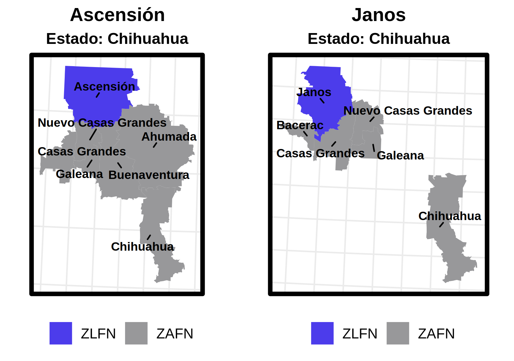
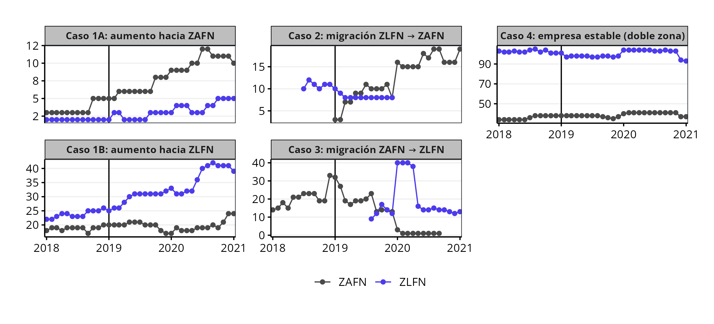

class: title-slide

<div class="title-main">

<h1>Decisiones de relocalización empresarial en la Frontera Norte</h1>

<h2>con Análisis de Supervivencia</h2>

<h3>Diego Alejandro Sánchez Rodríguez</h3>
<p class="title-inst">Comisión Nacional de los Salarios Mínimos (CONASAMI) de México</p>

</div>

<h4>
  
  /diegoasanchezr
</h4>

---

class: toc-slide

# Contenido

<ol>
  <li>Introducción</li>
  <li>Datos y Metodología</li>
  <li>Resultados</li>
  <li>Conclusiones</li>
</ol>

---

class: chapter-slide

# 1. Introducción

---

# 1. Introducción

- En enero de 2019 se creó la **Zona Libre de la Frontera Norte (ZLFN)**, combinando un **aumento del 100% en el salario mínimo** con **estímulos fiscales** —crédito del 33% al ISR y reducción del IVA del 16% al 8%—, lo que redefinió los incentivos territoriales y las decisiones de localización de las empresas.

- Estos mecanismos generan **dos fuerzas contrapuestas**:  
  - mayores **costos laborales** que empujan a algunas firmas a asentarse fuera de la ZLFN, y  
  - **beneficios fiscales significativos** que pueden incentivar su permanencia o incluso su llegada desde otras regiones.

---

- La literatura identifica varios márgenes de ajuste al salario mínimo (sustitución de factores, beneficios no salariales, entrada y salida), pero **este estudio incorpora la relocalización territorial** como un margen adicional poco explorado.

- **<span style="color:#4C3CEB;">Aaronson et al. (2018)</span>** encuentran que aumentos al salario mínimo en restaurantes de EE. UU. elevan la **entrada y salida**, pero **sin afectar el empleo** de los ya existentes; **<span style="color:#4C3CEB;">Mayneris et al. (2018)</span>** documentan en China una mayor **salida de empresas menos productivas**; **<span style="color:#4C3CEB;">Draca y Van Reenen (2011)</span>** muestran en Reino Unido que el salario mínimo **reduce rentabilidad**, pero **no acelera la salida**; **<span style="color:#4C3CEB;">Luca y Luca (2019)</span>** hallan que en EE. UU. el salario mínimo **no incrementa el cierre** de restaurantes.

- **<span style="color:#4C3CEB;">Rohlin (2011)</span>** muestra que en EE. UU. aumentos al salario mínimo **desincentivan la apertura de nuevas empresas**, especialmente en sectores intensivos en trabajadores con baja escolaridad, pero **no afectan la supervivencia** de las firmas existentes, lo que sugiere que las empresas consolidadas pueden adaptarse sin abandonar el mercado.


---

# Este estudio

- En México no existía evidencia sistemática sobre **relocalización empresarial**; este estudio cubre ese vacío usando **registros administrativos** y un **modelo de supervivencia** para analizar la dinámica territorial de empresas en la frontera norte.

- La relocalización fue un fenómeno **excepcional**: únicamente **1.15%** de las empresas mostró algún indicio de movilidad; cerca de la mitad **no cambió de ubicación** pese a los incentivos, lo que sugiere capacidad de resistencia entre unidades más consolidadas.

- Entre quienes sí respondieron, la **ZLFN concentró las preferencias de relocalización**, en línea con evidencia previa que no encuentra efectos significativos en empleo o precios tras el decreto de 2019 (**<span style="color:#4C3CEB;">Calderón et al. (2023)</span>**; **<span style="color:#4C3CEB;">Campos-Vázquez et al. (2020, 2021)</span>**; **<span style="color:#4C3CEB;">CONASAMI (2019)</span>**; **<span style="color:#4C3CEB;">Campos-Vázquez (2025)</span>**).


---

class: chapter-slide

# 2. Datos y Metodología

---

# Datos I

- Registros administrativos de seguridad social (2018–2021) a nivel relación laboral, filtrados para empresas de interés.

- Procesamiento masivo en paralelo con <span class="inline-pkg">{future.apply}</span>.

- Lectura por chunks con **fread()** (<span class="inline-pkg">{data.table}</span>) para evitar cargas completas en memoria.

- Función modular con manejo de errores y ensamblaje eficiente mediante rbindlist().

```{r, eval=FALSE}
plan(multisession, workers = availableCores() - 4)

resultados <- future_lapply(periodos, 
                            procesar_periodo, 
                            future.seed = TRUE)
```

---

class: map-slide

# Zona Libre de la Frontera Norte 
## y delimitación de la zona adyacente


<p class="map-caption">
<b>Fuente:</b> Elaboración propia con datos de INEGI y metodología de CONASAMI.
</p>

---

# Datos II

- Para empresas sin sector económico antes de 2020, se imputó la clasificación mediante un modelo de *random forest* con <span class="inline-pkg">{missRanger}</span>, validando su precisión contra datos agregados públicos.

- Se conservaron únicamente empresas con **trayectorias estables**: al menos **7 registros** en el periodo, presencia en **más de un municipio**, y **mínimo 6 observaciones** tanto en la ZLFN como en la zona adyacente.

- Con el subconjunto depurado, se **identificaron y clasificaron los casos de migración empresarial** para analizar patrones de movilidad territorial entre la ZLFN y los municipios colindantes.

---

# Metodología I

- Se construyó una **tipología de migración territorial** que clasifica a las empresas según sus patrones de localización antes y después del decreto de 2019.

- La estrategia compara territorios con condiciones **económicas y geográficas similares**, controlando elementos compartidos como infraestructura, clima y redes de proveeduría.

- El análisis se centra en la **movilidad empresarial hacia municipios colindantes** a la ZLFN y hacia las **capitales estatales**, permitiendo identificar patrones diferenciados de relocalización.

---

class: map-slide

# Ejemplos de municipios ZLFN
## y su ZAFN correspondiente


<p class="map-caption">
<b>Fuente:</b> Elaboración propia con datos de INEGI y metodología de CONASAMI.
</p>

---
# Metodología I

- Se implementó un **bucle robusto por municipio**, capaz de manejar casos sin migración detectada sin detener el procesamiento, mediante **`tryCatch()`** y retornos seguros.

- Se diseñaron dos funciones modulares:  
  - **`clasificar_migracion()`** para identificar empresas que **cambian de zona** antes y después del decreto.  
  - **`calcular_prop()`** para detectar empresas con **cambios significativos** en su distribución laboral entre zonas (≥ 5 p.p.).

- Las funciones operan sobre bases filtradas por **trayectorias temporales mínimas**, presencia en **más de un municipio**, y actividad suficiente en **ambas zonas** (≥ 6 observaciones por zona).

---

# Tipología de migración empresarial

- **Caso 1 — Empresas con operación previa en ambas zonas (ZLFN y ZAFN)**:  
  - **1.A:** Incrementan su presencia en la **ZAFN** sin cambiar de sede (≥ 5% del empleo).  
  - **1.B:** Incrementan su presencia en la **ZLFN** sin cambiar de sede (≥ 5% del empleo).

- **Caso 2 — Migración ZLFN → ZAFN**: Empresas que, después del corte, dejan de operar exclusivamente en municipios fronterizos y se mueven hacia la ZAFN.

- **Caso 3 — Migración ZAFN → ZLFN**: Empresas que, después del corte, dejan de operar exclusivamente en municipios no fronterizos y se trasladan hacia la ZLFN.

- **Caso 4 — Empresas estables**: Empresas que mantienen actividad en ambas zonas sin cambios significativos en la distribución territorial del empleo.

---


class: map-slide

# Ejemplos reales de migración de empresas
## Personas trabajadoras por empresa



<p class="map-caption">
  <b>Nota:</b> Cada caso es una empresa identificada en los registros del IMSS.<br>
  <b>Fuente:</b> Elaboración propia con información de IMSS y USNE y metodología de CONASAMI.
</p>

---

# Metodología II

- Se emplea el **modelo de Cox de riesgos proporcionales** (**<span style="color:#4C3CEB;">Cox, 1972</span>**), que estima el riesgo relativo (*hazard*) de migración sin imponer una forma funcional a la *baseline hazard*. Las covariables se interpretan como **efectos multiplicativos sobre el riesgo**, permitiendo comparar la probabilidad instantánea de migración entre empresas con distintas características.

- Un componente central del análisis es la **censura**, que aparece cuando el evento no se observa durante el periodo estudiado. Los principales tipos de censura incluyen:  
  - **Derecha:** el evento no ocurre antes de finalizar la observación.  
  - **Izquierda:** el evento ocurrió antes del inicio del registro.  
  - **Truncamiento:** ciertas observaciones quedan fuera porque el evento ocurrió fuera del intervalo analizado.

---

# Metodología II

- En este estudio, las empresas que **no migraron durante el periodo**, pero que permanecieron en riesgo mientras estuvieron activas (**Caso 4**), se tratan como **censuradas**, lo que permite aprovechar toda su trayectoria e **evitar sesgos por exclusión**.

- Dado el diseño temporal y la tipología definida, la censura es **por construcción derecha**, ya que todas las empresas estaban presentes al inicio del periodo.

- En el análisis de **riesgos competitivos**, la migración hacia la ZLFN y hacia la ZAFN se tratan como **eventos distintos**:  
  - una empresa que migra hacia una zona se considera **censurada** para el evento alternativo.
  
---

# Metodología II — Riesgos competitivos

- Se utiliza un enfoque de **regresión de riesgos proporcionales específicos de causa**, modelando por separado el riesgo de migración **hacia la ZAFN** y **hacia la ZLFN**, con **estratificación por sector económico**.

- Siguiendo a **<span style="color:#4C3CEB;">Lunn & McNeil (1995)</span>**, los riesgos competitivos se incorporan mediante una reformulación que permite estimar de manera conjunta los parámetros del modelo de **Cox** para cada tipo de falla.

- Se aplica la estrategia de **<span style="color:#4C3CEB;">Cleves (2000)</span>** para comparar los efectos de las covariables entre tipos de eventos, manteniendo la coherencia con la especificación de **riesgos específicos de causa estratificados**.

---

# Aplicación

- Se estiman regresiones de Cox bajo diferentes especificaciones, cada una diseñada para capturar un aspecto distinto de la dinámica migratoria empresarial.

- La **estratificación por sector económico** se justifica empíricamente: la prueba de *Schoenfeld* (**<span style="color:#4C3CEB;">Therneau, 2024</span>**) confirma que, tras estratificar, las especificaciones cumplen el supuesto de riesgos proporcionales.


- **Modelos estimados**

  1. **Modelo base de riesgos proporcionales** (migración agregada).  
  2. **Modelo de riesgos específicos** para migración hacia la **ZAFN**.  
  3. **Modelo de riesgos específicos** para migración hacia la **ZLFN**.  
  4. **Modelo de riesgos competitivos simultáneos** (ZAFN vs. ZLFN).  
  5. **Modelo de riesgos competitivos con interacciones**.
  
---

# Funciones y librerías empleadas

- Se emplean las librerías de análisis de supervivencia **<span class="inline-pkg">{survival}</span>** (**<span style="color:#4C3CEB;">Therneau, 2024</span>**) y **<span class="inline-pkg">{survminer}</span>**, utilizadas para estimar modelos de Cox, curvas de Kaplan–Meier y funciones de riesgo.

- El análisis parte de la construcción del objeto **Surv()**, que define el tiempo hasta el evento y la variable indicadora de migración.

```{r, eval=FALSE}
## Objeto de supervivencia ---------------------------------------------
base_surv <- Surv(
  time  = base$time,
  event = base$event
)
```

---
# Funciones y librerías empleadas

- Las curvas de **Kaplan–Meier** se estiman mediante **survfit()**, comparando trayectorias por tamaño de empresa y por división sectorial.

```{r, eval=FALSE}
## Curvas de Kaplan–Meier por tamaño -----------------------------------

km_size <- survfit(base_surv ~ size_label, data = base)

## Curvas de Kaplan–Meier por sector -----------------------------------

km_sector <- survfit(base_surv ~ sector_label, data = base)

## Resumen de supervivencia en tiempos específicos ---------------------

summary(km_sector, times = c(1, 12, 24, 36))
```

---
# Funciones y librerías empleadas

- Se estima un **modelo de Cox estratificado por sector económico**, utilizando **coxph()** para ajustar los efectos de las covariables y **cox.zph()** para evaluar el cumplimiento del supuesto de riesgos proporcionales.

```{r, eval=FALSE}
## Modelo estratificado para la forma 1---------------------
modelo_estrat <- coxph(base_surv ~ 
                         size_label +
                         strata(sector_label), 
                       data = base)

test_ph_estrat <- cox.zph(modelo_estrat)

```

---
# Funciones y librerías empleadas

- Para estimar riesgos específicos por causa se requiere redefinir el evento para cada destino (ZAFN y ZLFN) y construir un objeto de supervivencia (**Surv()**) acorde a cada tipo de migración.

- El procedimiento consiste en:
  - **recodificar el evento** según la causa de migración,
  - crear un objeto **Surv()** con *time* y *event* específicos, y
  - estimar el modelo de Cox con **coxph()** sobre la base ajustada.

---
### Ejemplo para un riesgo específico 


```{r, eval=FALSE}
# competing risks ----------------------------------------------------
# a ZAFN --------------------------------------------------------------

base_a_ZAFN <- base %>% 
  mutate(
    event_a_ZAFN = ifelse(event == 1 & causa == "Hacia ZAFN",
                          1, 0)
  )

base_surv_a_ZAFN <- Surv(
  time = base_a_ZAFN$time,
  event = base_a_ZAFN$event_a_ZAFN
)

```

---

### Riesgos competitivos simultáneos

- Para los riesgos competitivos simultáneos, cada empresa aparece dos veces: cuando migra hacia un destino ese registro se marca como **evento**, mientras que la migración hacia el otro destino se trata como **censura**; las empresas que nunca migraron (**Caso 4**) se registran como **censura en ambos casos**.

- Se estimaron modelos de riesgos competitivos **con y sin interacciones**, lo que permite evaluar si el efecto de las covariables varía según el destino de migración.

---

### Riesgos competitivos simultáneos

```{r, eval=FALSE}
# Modelo de riesgos competitivos sin interacción

modelo_sim <- coxph(
  base_surv ~ causa + size_label + strata(sector_label),
  data = base_cr
)

# Modelo de riesgos competitivos CON interacción

modelo_int <- coxph(
  base_surv ~ causa * size_label + strata(sector_label)
  data = base_cr
)

```

---

class: chapter-slide

# 3. Resultados

---
# Resultados descriptivos
### Distribución porcentual por sector

<table style="font-size:16pt; width:100%; border-collapse:collapse;">
<thead>
<tr style="color:#4C3CEB; font-weight:700; border-bottom:2px solid #4C3CEB;">
<th style="text-align:left; padding-bottom:6px;">Sector</th>
<th style="text-align:center; padding-bottom:6px;">1A<br><span style='font-size:12pt;'>ZAFN ↑</span></th>
<th style="text-align:center; padding-bottom:6px;">1B<br><span style='font-size:12pt;'>ZLFN ↑</span></th>
<th style="text-align:center; padding-bottom:6px;">2<br><span style='font-size:12pt;'>ZLFN → ZAFN</span></th>
<th style="text-align:center; padding-bottom:6px;">3<br><span style='font-size:12pt;'>ZAFN → ZLFN</span></th>
<th style="text-align:center; padding-bottom:6px;">4<br><span style='font-size:12pt;'>Estable</span></th>
</tr>
</thead>

<tbody>
<tr><td style="text-align:left; border-bottom:1px solid #DDD;">Industrias de transformación</td><td style="text-align:center;">4.28</td><td style="text-align:center;">5.15</td><td style="text-align:center;">10.61</td><td style="text-align:center;">8.23</td><td style="text-align:center;">6.63</td></tr>

<tr><td style="text-align:left; border-bottom:1px solid #DDD;">Comercio</td><td style="text-align:center;">33.16</td><td style="text-align:center;">36.60</td><td style="text-align:center;">23.46</td><td style="text-align:center;">22.08</td><td style="text-align:center;">51.63</td></tr>

<tr><td style="text-align:left; border-bottom:1px solid #DDD;">Transportes y comunicaciones</td><td style="text-align:center;">8.02</td><td style="text-align:center;">6.19</td><td style="text-align:center;">5.59</td><td style="text-align:center;">0.87</td><td style="text-align:center;">9.89</td></tr>

<tr><td style="text-align:left; border-bottom:1px solid #DDD;">Servicios para privados</td><td style="text-align:center;">34.76</td><td style="text-align:center;">29.38</td><td style="text-align:center;">24.58</td><td style="text-align:center;">12.99</td><td style="text-align:center;">25.09</td></tr>

<tr><td style="text-align:left; border-bottom:1px solid #DDD;">Sector primario</td><td style="text-align:center;">1.60</td><td style="text-align:center;">3.61</td><td style="text-align:center;">7.82</td><td style="text-align:center;">0.87</td><td style="text-align:center;">1.21</td></tr>

<tr><td style="text-align:left; border-bottom:1px solid #DDD;">Industria de construcción</td><td style="text-align:center;">18.18</td><td style="text-align:center;">19.07</td><td style="text-align:center;">27.93</td><td style="text-align:center;">54.98</td><td style="text-align:center;">5.55</td></tr>

<tr style="font-weight:bold; border-top:2px solid #4C3CEB;">
<td style="text-align:left;">Total (%)</td>
<td style="text-align:center;">100</td>
<td style="text-align:center;">100</td>
<td style="text-align:center;">100</td>
<td style="text-align:center;">100</td>
<td style="text-align:center;">100</td>
</tr>
</tbody>
</table>

<p style="font-size:12pt; color:#4A4A4A; text-align:center; margin-top:10px;">
<b>Fuente:</b> Elaboración propia con información de IMSS y USNE y metodología de CONASAMI.
</p>

---
# Resultados descriptivos
### Distribución porcentual por tamaño

<table style="font-size:16pt; width:100%; border-collapse:collapse;">
<thead>
<tr style="color:#4C3CEB; font-weight:700; border-bottom:2px solid #4C3CEB;">
<th style="text-align:left; padding-bottom:6px;">Tamaño</th>
<th style="text-align:center; padding-bottom:6px;">1A<br><span style='font-size:12pt;'>ZAFN ↑</span></th>
<th style="text-align:center; padding-bottom:6px;">1B<br><span style='font-size:12pt;'>ZLFN ↑</span></th>
<th style="text-align:center; padding-bottom:6px;">2<br><span style='font-size:12pt;'>ZLFN → ZAFN</span></th>
<th style="text-align:center; padding-bottom:6px;">3<br><span style='font-size:12pt;'>ZAFN → ZLFN</span></th>
<th style="text-align:center; padding-bottom:6px;">4<br><span style='font-size:12pt;'>Estable</span></th>
</tr>
</thead>

<tbody>
<tr><td style="text-align:left; border-bottom:1px solid #DDD;">Microempresa</td><td style="text-align:center;">24.06</td><td style="text-align:center;">21.13</td><td style="text-align:center;">17.88</td><td style="text-align:center;">14.72</td><td style="text-align:center;">7.72</td></tr>

<tr><td style="text-align:left; border-bottom:1px solid #DDD;">Pequeña empresa</td><td style="text-align:center;">29.41</td><td style="text-align:center;">30.41</td><td style="text-align:center;">32.96</td><td style="text-align:center;">25.54</td><td style="text-align:center;">20.39</td></tr>

<tr><td style="text-align:left; border-bottom:1px solid #DDD;">Mediana empresa</td><td style="text-align:center;">22.99</td><td style="text-align:center;">26.29</td><td style="text-align:center;">21.79</td><td style="text-align:center;">38.96</td><td style="text-align:center;">29.19</td></tr>

<tr><td style="text-align:left; border-bottom:1px solid #DDD;">Gran empresa</td><td style="text-align:center;">23.53</td><td style="text-align:center;">22.16</td><td style="text-align:center;">27.37</td><td style="text-align:center;">20.78</td><td style="text-align:center;">42.70</td></tr>

<tr style="font-weight:bold; border-top:2px solid #4C3CEB;">
<td style="text-align:left;">Total (%)</td>
<td style="text-align:center;">100</td>
<td style="text-align:center;">100</td>
<td style="text-align:center;">100</td>
<td style="text-align:center;">100</td>
<td style="text-align:center;">100</td>
</tr>
</tbody>
</table>

<p style="font-size:12pt; color:#4A4A4A; text-align:center; margin-top:10px;">
<b>Fuente:</b> Elaboración propia con información de IMSS y USNE y metodología de CONASAMI.
</p>

---
# Resultados descriptivos
### Meses hasta la migración por sector económico

<table style="font-size:16pt; width:100%; border-collapse:collapse;">
<thead>
<tr style="color:#4C3CEB; font-weight:700; border-bottom:2px solid #4C3CEB;">
<th style="text-align:left; padding-bottom:6px;">Sector</th>
<th style="text-align:center; padding-bottom:6px;">N. empresas</th>
<th style="text-align:center; padding-bottom:6px;">Meses promedio</th>
<th style="text-align:center; padding-bottom:6px;">Mediana de meses</th>
</tr>
</thead>

<tbody>

<tr>
<td style="text-align:left; border-bottom:1px solid #DDD;">Industrias de transformación</td>
<td style="text-align:center;">56</td>
<td style="text-align:center;">13.00</td>
<td style="text-align:center;">9.62</td>
</tr>

<tr>
<td style="text-align:left; border-bottom:1px solid #DDD;">Comercio</td>
<td style="text-align:center;">226</td>
<td style="text-align:center;">11.69</td>
<td style="text-align:center;">10.13</td>
</tr>

<tr>
<td style="text-align:left; border-bottom:1px solid #DDD;">Transportes y comunicaciones</td>
<td style="text-align:center;">39</td>
<td style="text-align:center;">14.53</td>
<td style="text-align:center;">13.20</td>
</tr>

<tr>
<td style="text-align:left; border-bottom:1px solid #DDD;">Servicios para privados</td>
<td style="text-align:center;">196</td>
<td style="text-align:center;">9.25</td>
<td style="text-align:center;">6.13</td>
</tr>

<tr>
<td style="text-align:left; border-bottom:1px solid #DDD;">Sector primario</td>
<td style="text-align:center;">26</td>
<td style="text-align:center;">7.69</td>
<td style="text-align:center;">5.62</td>
</tr>

<tr style="border-bottom:2px solid #4C3CEB;">
<td style="text-align:left; padding:6px 0;">Industria de construcción</td>
<td style="text-align:center;">248</td>
<td style="text-align:center;">13.47</td>
<td style="text-align:center;">12.17</td>
</tr>

</tbody>
</table>

<p style="font-size:12pt; color:#4A4A4A; text-align:center; margin-top:10px;">
<b>Fuente:</b> Elaboración propia con información de IMSS y USNE y metodología de CONASAMI.
</p>


---
# Resultados descriptivos
### Meses hasta la migración por tamaño de empresa

<table style="font-size:16pt; width:100%; border-collapse:collapse;">
<thead>
<tr style="color:#4C3CEB; font-weight:700; border-bottom:2px solid #4C3CEB;">
<th style="text-align:left; padding-bottom:6px;">Tamaño</th>
<th style="text-align:center; padding-bottom:6px;">N. empresas</th>
<th style="text-align:center; padding-bottom:6px;">Meses promedio</th>
<th style="text-align:center; padding-bottom:6px;">Mediana de meses</th>
</tr>
</thead>

<tbody>

<tr>
<td style="text-align:left; border-bottom:1px solid #DDD;">Microempresa</td>
<td style="text-align:center;">152</td>
<td style="text-align:center;">9.81</td>
<td style="text-align:center;">7.07</td>
</tr>

<tr>
<td style="text-align:left; border-bottom:1px solid #DDD;">Pequeña empresa</td>
<td style="text-align:center;">232</td>
<td style="text-align:center;">11.06</td>
<td style="text-align:center;">9.10</td>
</tr>

<tr>
<td style="text-align:left; border-bottom:1px solid #DDD;">Mediana empresa</td>
<td style="text-align:center;">223</td>
<td style="text-align:center;">13.55</td>
<td style="text-align:center;">12.17</td>
</tr>

<tr style="border-bottom:2px solid #4C3CEB;">
<td style="text-align:left; padding:6px 0;">Gran empresa</td>
<td style="text-align:center;">184</td>
<td style="text-align:center;">12.00</td>
<td style="text-align:center;">9.10</td>
</tr>

</tbody>
</table>

<p style="font-size:12pt; color:#4A4A4A; text-align:center; margin-top:10px;">
<b>Fuente:</b> Elaboración propia con información de IMSS y USNE y metodología de CONASAMI.
</p>

---

# Resultados descriptivos
### Probabilidades empíricas acumuladas de migración empresarial hacia ZAFN y ZLFN

<table style="font-size:16pt; width:100%; border-collapse:collapse;"> <thead> <tr style="color:#4C3CEB; font-weight:700; border-bottom:2px solid #4C3CEB;"> <th style="text-align:left; padding-bottom:6px;">Tiempo (meses)</th> <th style="text-align:center; padding-bottom:6px;">Prob. migración<br>ZAFN</th> <th style="text-align:center; padding-bottom:6px;">Supervivencia<br>(no migrar a ZAFN)</th> <th style="text-align:center; padding-bottom:6px;">Prob. migración<br>ZLFN</th> <th style="text-align:center; padding-bottom:6px;">Supervivencia<br>(no migrar a ZLFN)</th> </tr> </thead> <tbody> <tr> <td style="text-align:left; border-bottom:1px solid #DDD;">1</td> <td style="text-align:center; border-bottom:1px solid #DDD;">0.0148</td> <td style="text-align:center; border-bottom:1px solid #DDD;">0.9852</td> <td style="text-align:center; border-bottom:1px solid #DDD;">0.0253</td> <td style="text-align:center; border-bottom:1px solid #DDD;">0.9747</td> </tr> <tr> <td style="text-align:left; border-bottom:1px solid #DDD;">12</td> <td style="text-align:center; border-bottom:1px solid #DDD;">0.1479</td> <td style="text-align:center; border-bottom:1px solid #DDD;">0.8521</td> <td style="text-align:center; border-bottom:1px solid #DDD;">0.1520</td> <td style="text-align:center; border-bottom:1px solid #DDD;">0.8480</td> </tr> <tr> <td style="text-align:left; border-bottom:1px solid #DDD;">18</td> <td style="text-align:center; border-bottom:1px solid #DDD;">0.1986</td> <td style="text-align:center; border-bottom:1px solid #DDD;">0.8014</td> <td style="text-align:center; border-bottom:1px solid #DDD;">0.2134</td> <td style="text-align:center; border-bottom:1px solid #DDD;">0.7866</td> </tr> <tr style="border-bottom:2px solid #4C3CEB;"> <td style="text-align:left; padding:6px 0;">24</td> <td style="text-align:center;">0.2252</td> <td style="text-align:center;">0.7748</td> <td style="text-align:center;">0.2470</td> <td style="text-align:center;">0.7530</td> </tr> </tbody> </table> <p style="font-size:12pt; color:#4A4A4A; text-align:center; margin-top:10px;"> <b>Fuente:</b> Cálculos propios con curvas de Kaplan–Meier para migración hacia ZAFN y ZLFN. </p>

---
# Resultados descriptivos

- <span style="color:#4C3CEB; font-weight:700;">Heterogeneidad sectorial y por tamaño:</span> Comercio y Servicios destacan por su peso en estabilidad y ajustes parciales; grandes empresas tienden a operar en ambas zonas, mientras que microempresas presentan menor estabilidad y más ajustes de empleo.

- <span style="color:#4C3CEB; font-weight:700;">Velocidad diferenciada de migración por sector y tamaño:</span> sectores con menor inversión en capital fijo (Primario y Servicios privados) migran más rápido (7–9 meses), mientras que Industrias, Construcción y Transportes requieren más tiempo (13–14 meses). De forma consistente, micro y pequeñas empresas muestran mayor agilidad (≈10–11 meses), mientras que las medianas y grandes tardan más en reorganizar su localización.

- <span style="color:#4C3CEB; font-weight:700;">Baja propensión inicial a migrar:</span> más del 85% de las empresas permanecen en su ubicación durante el primer año; las probabilidades de migración aumentan gradualmente hasta 15% a los 12 meses y 22–25% a los 24 meses, con la mayoría de empresas permaneciendo estables y una migración ligeramente mayor hacia ZLFN que hacia ZAFN.


---
# Resultados de las regresiones

<table style="font-size:16pt; width:100%; border-collapse:collapse;">
<thead>
<tr style="color:#4C3CEB; font-weight:700; border-bottom:2px solid #4C3CEB;">
  <th style="text-align:left; padding-bottom:6px;">Variable</th>
  <th style="text-align:center; padding-bottom:6px;">(1)<br><span style='font-size:12pt;'>HR</span></th>
  <th style="text-align:center; padding-bottom:6px;">(2)<br><span style='font-size:12pt;'>HR</span></th>
  <th style="text-align:center; padding-bottom:6px;">(3)<br><span style='font-size:12pt;'>HR</span></th>
  <th style="text-align:center; padding-bottom:6px;">(4)<br><span style='font-size:12pt;'>HR</span></th>
  <th style="text-align:center; padding-bottom:6px;">(5)<br><span style='font-size:12pt;'>HR</span></th>
</tr>
</thead>

<tbody>

<tr>
<td style="text-align:left; border-bottom:1px solid #DDD;">Pequeña empresa</td>
<td style="text-align:center;">0.7322***</td>
<td style="text-align:center;">0.7252**</td>
<td style="text-align:center;">0.7449**</td>
<td style="text-align:center;">0.7346***</td>
<td style="text-align:center;">0.7113**</td>
</tr>

<tr>
<td style="text-align:left; border-bottom:1px solid #DDD;">Mediana empresa</td>
<td style="text-align:center;">0.4970***</td>
<td style="text-align:center;">0.3832***</td>
<td style="text-align:center;">0.6111***</td>
<td style="text-align:center;">0.4996***</td>
<td style="text-align:center;">0.3613***</td>
</tr>

<tr>
<td style="text-align:left; border-bottom:1px solid #DDD;">Gran empresa</td>
<td style="text-align:center;">0.3788***</td>
<td style="text-align:center;">0.3820***</td>
<td style="text-align:center;">0.3800***</td>
<td style="text-align:center;">0.3811***</td>
<td style="text-align:center;">0.3798***</td>
</tr>

<tr>
<td style="text-align:left; border-bottom:1px solid #DDD;">Hacia ZLFN</td>
<td style="text-align:center;"></td>
<td style="text-align:center;"></td>
<td style="text-align:center;"></td>
<td style="text-align:center;">1.1620**</td>
<td style="text-align:center;">0.9713</td>
</tr>

<tr>
<td style="text-align:left; border-bottom:1px solid #DDD;">Hacia ZLFN:<br>Pequeña empresa</td>
<td style="text-align:center;"></td>
<td style="text-align:center;"></td>
<td style="text-align:center;"></td>
<td style="text-align:center;"></td>
<td style="text-align:center;">1.0663</td>
</tr>

<tr>
<td style="text-align:left; border-bottom:1px solid #DDD;">Hacia ZLFN:<br>Mediana empresa</td>
<td style="text-align:center;"></td>
<td style="text-align:center;"></td>
<td style="text-align:center;"></td>
<td style="text-align:center;"></td>
<td style="text-align:center;">1.7779***</td>
</tr>

<tr style="border-bottom:2px solid #4C3CEB;">
<td style="text-align:left; padding:6px 0;">Hacia ZLFN:<br>Gran empresa</td>
<td style="text-align:center;"></td>
<td style="text-align:center;"></td>
<td style="text-align:center;"></td>
<td style="text-align:center;"></td>
<td style="text-align:center;">1.0068</td>
</tr>

</tbody>
</table>

<p style="font-size:12pt; color:#4A4A4A; margin-top:10px; text-align:center;">
<b>Nota:</b> HR &lt; 1 indica menor riesgo de migración; HR &gt; 1 mayor riesgo. Categoría de referencia: Microempresa y migración hacia ZAFN.<br>
<b>Fuente:</b> Elaboración propia.
</p>

---

### Resultados de la prueba de Schoenfeld para riesgos proporcionales

<table style="font-size:16pt; width:100%; border-collapse:collapse;"> <thead> <tr style="color:#4C3CEB; font-weight:700; border-bottom:2px solid #4C3CEB;"> <th style="text-align:left; padding-bottom:6px;">Término</th> <th style="text-align:center; padding-bottom:6px;">χ² (1)</th> <th style="text-align:center; padding-bottom:6px;">p (1)</th> <th style="text-align:center; padding-bottom:6px;">χ² (2)</th> <th style="text-align:center; padding-bottom:6px;">p (2)</th> <th style="text-align:center; padding-bottom:6px;">χ² (3)</th> <th style="text-align:center; padding-bottom:6px;">p (3)</th> <th style="text-align:center; padding-bottom:6px;">χ² (4)</th> <th style="text-align:center; padding-bottom:6px;">p (4)</th> <th style="text-align:center; padding-bottom:6px;">χ² (5)</th> <th style="text-align:center; padding-bottom:6px;">p (5)</th> </tr> </thead> <tbody> <tr> <td style="text-align:left; border-bottom:1px solid #DDD;">Tamaño</td> <td style="text-align:center; border-bottom:1px solid #DDD;">4.3655</td> <td style="text-align:center; border-bottom:1px solid #DDD;">0.2246</td> <td style="text-align:center; border-bottom:1px solid #DDD;">7.4473</td> <td style="text-align:center; border-bottom:1px solid #DDD;">0.0589</td> <td style="text-align:center; border-bottom:1px solid #DDD;">5.5461</td> <td style="text-align:center; border-bottom:1px solid #DDD;">0.1359</td> <td style="text-align:center; border-bottom:1px solid #DDD;">4.4467</td> <td style="text-align:center; border-bottom:1px solid #DDD;">0.2171</td> <td style="text-align:center; border-bottom:1px solid #DDD;">4.4649</td> <td style="text-align:center; border-bottom:1px solid #DDD;">0.2154</td> </tr> <tr> <td style="text-align:left; border-bottom:1px solid #DDD;">Causa</td> <td style="text-align:center; border-bottom:1px solid #DDD;"></td> <td style="text-align:center; border-bottom:1px solid #DDD;"></td> <td style="text-align:center; border-bottom:1px solid #DDD;"></td> <td style="text-align:center; border-bottom:1px solid #DDD;"></td> <td style="text-align:center; border-bottom:1px solid #DDD;"></td> <td style="text-align:center; border-bottom:1px solid #DDD;"></td> <td style="text-align:center; border-bottom:1px solid #DDD;">1.8932</td> <td style="text-align:center; border-bottom:1px solid #DDD;">0.1688</td> <td style="text-align:center; border-bottom:1px solid #DDD;">1.4581</td> <td style="text-align:center; border-bottom:1px solid #DDD;">0.2272</td> </tr> <tr> <td style="text-align:left; border-bottom:1px solid #DDD;">Causa × Tamaño</td> <td style="text-align:center; border-bottom:1px solid #DDD;"></td> <td style="text-align:center; border-bottom:1px solid #DDD;"></td> <td style="text-align:center; border-bottom:1px solid #DDD;"></td> <td style="text-align:center; border-bottom:1px solid #DDD;"></td> <td style="text-align:center; border-bottom:1px solid #DDD;"></td> <td style="text-align:center; border-bottom:1px solid #DDD;"></td> <td style="text-align:center; border-bottom:1px solid #DDD;"></td> <td style="text-align:center; border-bottom:1px solid #DDD;"></td> <td style="text-align:center; border-bottom:1px solid #DDD;">7.5078</td> <td style="text-align:center; border-bottom:1px solid #DDD;">0.0573</td> </tr> <tr style="border-bottom:2px solid #4C3CEB; font-weight:bold;"> <td style="text-align:left; padding:6px 0;">GLOBAL</td> <td style="text-align:center;">4.3655</td> <td style="text-align:center;">0.2246</td> <td style="text-align:center;">7.4473</td> <td style="text-align:center;">0.0589</td> <td style="text-align:center;">5.5461</td> <td style="text-align:center;">0.1359</td> <td style="text-align:center;">6.3467</td> <td style="text-align:center;">0.1747</td> <td style="text-align:center;">14.2976</td> <td style="text-align:center;">0.0461</td> </tr> </tbody> </table> <p style="font-size:12pt; color:#4A4A4A; text-align:center; margin-top:10px;"> <b>Nota:</b> La hipótesis nula es que los riesgos son proporcionales en el tiempo. Un valor-p alto (p > 0.05) indica que no se rechaza el supuesto de proporcionalidad. <br><b>Fuente:</b> Elaboración propia. </p>


---

# Resultados de las regresiones

- En general, <span style="color:#4C3CEB; font-weight:700;">a mayor tamaño empresarial, menor riesgo</span>: las medianas reducen el riesgo entre 38%–61%, y las grandes alrededor de 38%, sin preferencia de destino.

- En los <span style="color:#4C3CEB; font-weight:700;">modelos de riesgos específicos</span>, las medianas empresas muestran reducciones diferenciadas según destino: <span style="color:#4C3CEB; font-weight:700;">61.7% menos riesgo hacia ZAFN</span> y <span style="color:#4C3CEB; font-weight:700;">38.9% menos hacia ZLFN</span>, indicando que la ZAFN es menos atractiva para ellas en comparación con la ZLFN.

- El modelo de <span style="color:#4C3CEB; font-weight:700;">riesgos competitivos sin interacción</span> muestra que migrar hacia la <span style="color:#4C3CEB; font-weight:700;">ZLFN</span> implica un riesgo 16% mayor que migrar hacia la ZAFN, evidenciando una preferencia promedio por la ZLFN entre empresas migrantes.

- En el modelo con <span style="color:#4C3CEB; font-weight:700;">interacción tamaño × destino</span>, para las microempresas, el HR de 0.9713 hacia la ZLFN implica un riesgo ligeramente menor respecto a la ZAFN, pero sin significancia estadística, lo que señala indiferencia entre destinos para este grupo.

---
class: chapter-slide

# 4. Conclusiones

---
# Conclusiones y consideraciones finales

- <span style="color:#4C3CEB; font-weight:700;">La movilidad empresarial es excepcional:</span> solo el 1.15% de las empresas muestra algún indicio de relocalización; incluso entre ellas, cerca de la mitad no cambió de ubicación, reflejando una fuerte estabilidad, especialmente en unidades de mayor tamaño.

- <span style="color:#4C3CEB; font-weight:700;">Mayor sensibilidad de microempresas:</span> presentan menor estabilidad territorial y ajustan más vía cambios en el empleo.

- <span style="color:#4C3CEB; font-weight:700;">Consideraciones para la interpretación:</span> aunque los datos no permiten aislar el efecto puntual del salario mínimo o los incentivos fiscales, la tipología de migración y la comparación con municipalidades vecinas refuerzan la validez de los resultados. De manera consistente, la **ZLFN** aparece como **destino preferente**, sugiriendo que el aumento del **salario mínimo no ha sido un impedimento significativo** para la localización empresarial en la región.

---
class: chapter-slide

# ¡Gracias!
